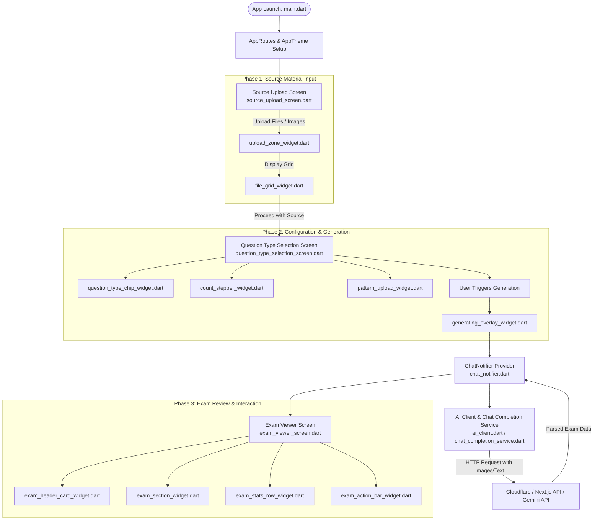

# Flutter Exam & Note Processing App: Architectural & Flow Analysis

This document provides a comprehensive architectural analysis and end-to-end execution flow of the Flutter mobile application, based on the codebase structure provided in the project archive.

---

## 1. High-Level Architecture

The application follows a **feature-driven modular architecture** combined with a reactive state management pattern. Responsibilities are cleanly separated into distinct layers:

1. **Presentation Layer (`lib/presentation/`)**: Contains screens and modular widgets responsible for rendering the UI and capturing user intent.
2. **State Management Layer (`lib/providers/`)**: Houses reactive notifiers (such as `chat_notifier.dart`) that bridge user actions with backend operations and maintain application state.
3. **Core Services Layer (`lib/core/`)**: Handles infrastructure concerns, including network communication, API client wrappers, and AI pipeline integrations (e.g., Gemini chat completions).
4. **Data Models Layer (`lib/models/`)**: Defines strongly-typed Dart data structures and serialization logic for parsing inputs and API responses.
5. **Theme & Routing Layer (`lib/theme/`, `lib/routes/`)**: Centralizes global design tokens, color schemes, typography, and navigation paths.

---

## 2. Application Flow Diagram

The following Mermaid sequence and flowchart illustrate how a user moves through the application, from source upload to exam generation and viewing.

---

## 3. Detailed File-by-File Flow Breakdown

### A. Bootstrapping & Core Configuration
* **`lib/main.dart`**: Initializes system bindings, configures dependency injection/providers, and mounts the root widget.
* **`lib/routes/app_routes.dart`**: Defines all navigation routes, connecting screens together using named navigation.
* **`lib/theme/app_theme.dart`**: Enforces a consistent design system (colors, text themes, card borders).
* **`lib/core/app_export.dart`**: Acts as a central barrel file to reduce boilerplate import statements across feature screens.

### B. Phase 1: Source Upload Flow (`lib/presentation/source_upload_screen/`)
* **`source_upload_screen.dart`**: The entry screen where users select documents or snap photos of study notes.
* **`upload_zone_widget.dart`**: Interactive drop/tap target for picking files.
* **`file_grid_widget.dart`**: Renders a thumbnail preview grid of selected files.
* **`source_app_bar_widget.dart`**: Custom header providing navigation controls and status actions.

### C. Phase 2: Configuration & AI Trigger Flow (`lib/presentation/question_type_selection_screen/`)
* **`question_type_selection_screen.dart`**: Allows customization of exam parameters (e.g., multiple-choice vs. essay, question counts).
* **`question_type_chip_widget.dart`**: Toggle chips for picking question categories.
* **`count_stepper_widget.dart`**: Increment/decrement widget for setting question quantity.
* **`pattern_upload_widget.dart`**: Optional upload field for providing structural templates or sample exams.
* **`generating_overlay_widget.dart`**: Full-screen modal overlay showing progress spinners while waiting for AI generation.

### D. Phase 3: Results & Review Flow (`lib/presentation/exam_viewer_screen/`)
* **`exam_viewer_screen.dart`**: Displays the structured exam output returned by the backend.
* **`exam_header_card_widget.dart`**: Summarizes metadata (title, subject, total score).
* **`exam_section_widget.dart`**: Groups questions into logical sections.
* **`exam_stats_row_widget.dart`**: Displays analytical metrics (difficulty breakdown, estimated time).
* **`exam_action_bar_widget.dart`**: Provides controls to export, share, or submit answers.

### E. State Management, Networking, and Data (`lib/providers/`, `lib/core/`, `lib/models/`)
* **`lib/providers/chat_notifier.dart`**: Manages the reactive state during chat or prompt assembly sequences, coordinating between user inputs and network calls.
* **`lib/core/services/ai_client.dart` & `chat_completion_service.dart`**: Encapsulates network operations interfacing with external generative models (such as Google Gemini).
* **`lib/models/exam_models.dart`**: Strongly typed data structures (`Exam`, `Question`, `Payload`) mapping incoming and outgoing JSON data.
* **`lib/widgets/`**: Reusable generic atoms (`custom_error_widget.dart`, `custom_icon_widget.dart`, `custom_image_widget.dart`) used throughout the app.
